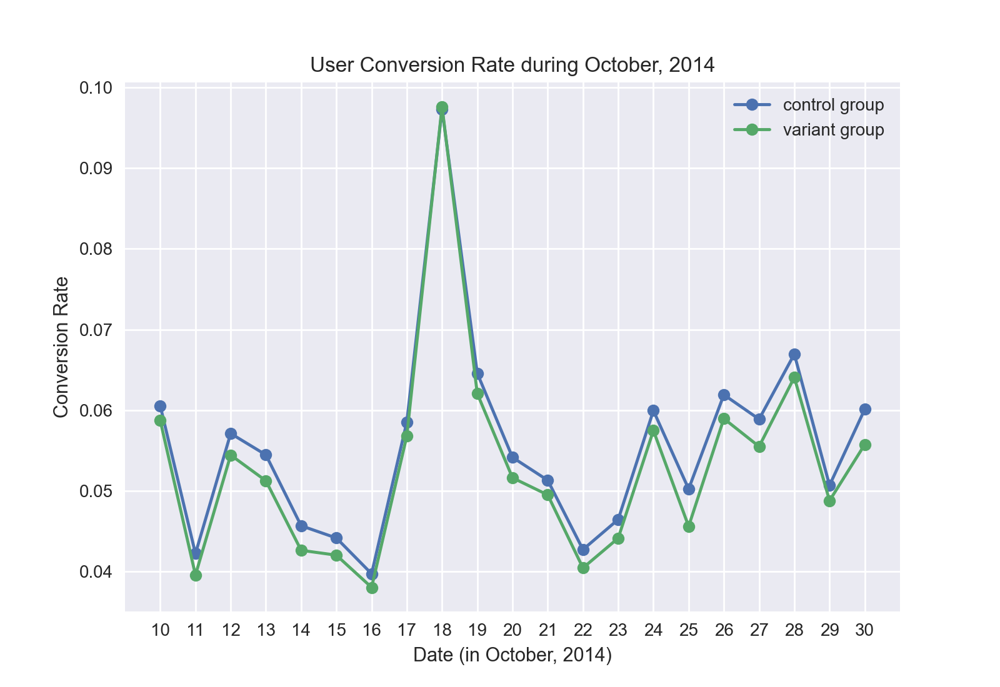

# Viagogo Front-Page AB Test Results

## Part I

### Experiment

Our app's home page features 10 event categories to our users.  Which 10 categories we pick has an impact on how many users ultimately buy tickets.

We performed an AB test to compare two category-picking strategies:

  * Strategy A: 'control' -- display the 10 most popular categories.  This is the current behavior of our app.
  * Startegy B: 'variant' -- display the 10 categories nearest to the user's location with events this week.

We are using two metrics to quantify the efficacy of a strategy:

  * 'conversion rate' -- the percentage of home page visitors who buy a ticket
  * 'bounce rate' -- the percentage of home page visitors who left our website immediately

So ideally we want a high conversion rate and a low bounce rate.

### Results

Comparing the 'control' and 'variant' strategies using the conversion rate,

we have that the 'control' strategy outperforms the 'variant' strategy every day except for October 18th.  Looking at the total for the entire month, the conversion rate for the control is 5.6% while for the variant it is 5.3%.  Switching our app to the variant strategy could decrease ticket purchases by about 4.6%.

Comparing our strategies using the bounce rate,

we have that the 'control' strategy outperforms the 'variant' strategy every single day.  Looking at the total for the entire month, the bounce rate for the control is 39.7% while for the variant it is 41.2%.  Switching our app to the variant strategy could increase visitors abandoning our website by 4.0% (relative change).

DISCUSS NOTABLE TRENDS IN THE METRICS

You can see from the conversion and bounce rate graphs that they are negatively correlated.  That is, when the conversion rate is high, the bounce rate is low, and vice-versa.

MENTION any supplementary analysis

### Conclusion

The results clearly show that the 'variant' strategy is worse than our current 'control' strategy.  We should revert to the control strategy.

IS THERE more data you would like to consider before deciding?

---

## Part II

Having just run the experiment described in Part 1, you are now tasked with coming up with the
next experiment to run on the mobile homepage.

  1. List five potential improvements you would make to the current page. Explain your reasoning.
  2. What additional data would you like to know to help you assess which idea to prioritize?
  3. How would you measure the success or failure of each of these chang

---

## Developer README notes

This repo contains the viagogo case study code.

### Install

To install deps:

	pip3 install -r requirements.txt

### Run

Look at the `main()` function inside `main.py` and modify it according to what information you want to generate.  Then open the terminal and run:

	python3 main.py

