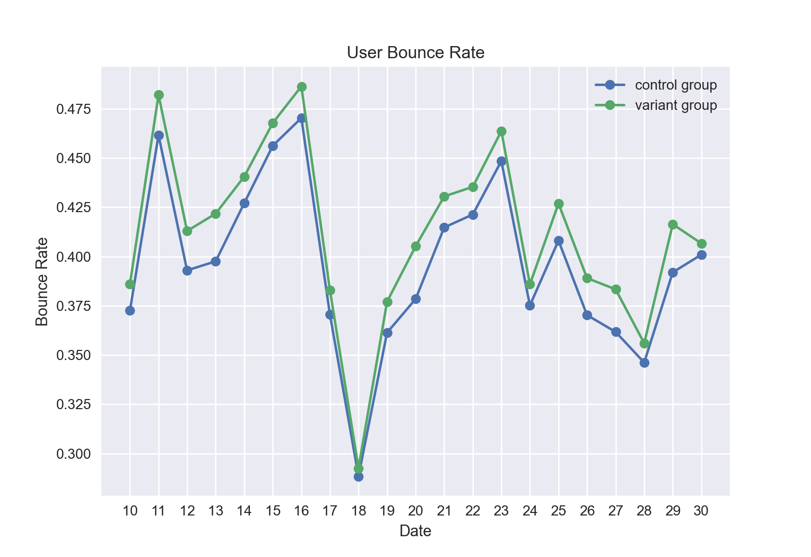
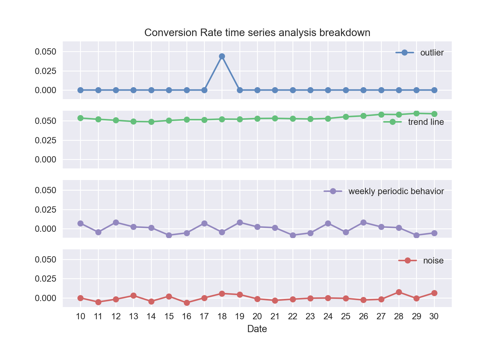

# Viagogo Front-Page AB Test Results

 
 

## Part I

 

### Experiment

Our app's home page features 10 event categories to our users.  Which 10 categories we pick has an impact on how many users ultimately buy tickets.

We performed an AB test to compare two category-picking strategies:

  * Strategy A: **control** -- display the 10 most popular categories.  This is the current behavior of our app.
  * Startegy B: **variant** -- display the 10 categories nearest to the user's location with events this week.

 
We are using two metrics to quantify the efficacy of a strategy:

  * _conversion rate_ -- the percentage of home page visitors who buy a ticket
  * _bounce rate_ -- the percentage of home page visitors who left our website immediately

So ideally we want a high conversion rate and a low bounce rate.

 

### Results

We compare the **control** and **variant** strategies using the conversion rate:

The **control** strategy outperforms the **variant** strategy every day except for October 18th.  Looking at the total for the entire month, the conversion rate for the control is `5.6%` while for the variant it is `5.3%`.  Switching our app to the variant strategy could decrease ticket purchases by about `4.6%` (relative change).

We compare our strategies again, this time using the _bounce rate_:

The **control** strategy outperforms the **variant** strategy every single day.  Looking at the total for the entire month, the bounce rate for the control is `39.7%` while for the variant it is `41.2%`.  Switching our app to the variant strategy could increase visitors abandoning our website by `4.0%` (relative change).

 

You can see from the conversion and bounce rate graphs that they are negatively correlated.  That is, when the conversion rate is high, the bounce rate is low, and vice-versa.

There is a spike in the conversion rate on October 18th.  This may indicate that there was a big event coming up, and users were arriving at the app having already decided to buy tickets.

The following time series analysis breaks up the conversion rate into the _sum of 4 separate components_: The October 18th outlier, the rolling average trend, the weekly periodic behavior, and the remaining noise:

The trend is relatively constant, increasing slightly over the course of the month.

From the periodic behavior we can see that the highest conversion rate occurs on _Sundays_ while the lowest occurs on _Wednesdays_.

 

### Conclusion

The results show that the **variant** strategy is worse than our current **control** strategy.  But is the difference statistically significant?

We have two separate groups (the "A" and "B" groups of visitors), and we are measuring the same proportion (conversion rate) for each.  This means that we must use a _Two Proportion Z-Test_ to determine the statistical significance.

 

### Two Proportion Z-Test

The Two Proportion Z-Test requires that there is no overlap between the A and B groups.  I restricted the z-test data to "New User"s only to prevent double-counting of users.

Our null hypothesis is that the conversion rate is equal for the A and B group.  Our alternative hypothesis is that the **control** population conversion rate is greater than that of the **variant**.  This is a right-tailed distribution.  The test statistic `z` is:

    z = (p1 - p2) / sqrt(p * (1-p) * (1/n1 + 1/n2))

where

    p1 = 0.0528466624522219  # conversion rate for the control
    p2 = 0.0511905739612249  # conversion rate for the variant
    p  = 0.0520074951962051  # conversion rate for both combined
    n1 = 1778012             # number of people in control group
    n2 = 1826430             # number of people in variant group

so that

    z = 7.079424549201197

so that the p-value is less than `0.00001` (mainly due to our very high `n1` and `n2`), and thus the result IS statistically significant!  We should therefore revert to the control strategy.

 
 

## Part II

### Improvement ideas

All of the following improvement ideas could be tested with an AB test similar to the one we just conducted.

 

#### 1.

Try a strategy that _combines_ location and popularity.  For example, location gets a point value between `0` and `1`, and popularity gets a point value between `0` and `1`.  The sum of these point values is the total point value for a category.  For simplicity let's say that a category has a single location (but in reality we can do these computations on a per-event basis and figure out what to do w/ the categories from that).

Let `MD` be the maximum distance (in minutes, by google maps drive time estimate) across all categories.

Let `d` be the distance of the category.

Then `1 - d/MD` can be the location point value.

Similarly, let `MT` be the maximum number of tickets sold across all categories.

Let `t` be the number of tickets sold of the category.

Then `t/MT` can be the popularity point value.

 

#### 2.

Use user data to get a more specific idea of what is popular for THEM.  We can use machine learning to build a predictive algorithm to see which categories they are most likely to buy tickets from, and then use the top 10 categories on the user's home page.

The algo could potentially take in input data such as **location**, **age**, **gender**, **education**, **interests**, **ethnicity**, and/or **socio-economic status**, and output probabilities of buying tickets in each category.

Any ML algorithm that fits the data well could do.  It could be logistic regression, decision trees, neural networks, and possibly even an ensemble model combining different techniques.  It all depends on the data once you get your hands on it.

 

#### 3.

Use the user's _social connections_ to predict what they will buy.  If users give Facebook and/or similar products access to their viagogo accounts, then we can examine their social network to see what their friends are buying.

Consider the network of people.  A pair of people are connected by an edge if the two people are "friends".  Consider user `U`.  Any person ``P`` in the network has a "shortest path" distance to user `U`, which is the smallest number of edges you need to traverse to get from `P` to `U`.  This concept is also commonly referred to as the "Erdős number" or recently in popular culture the "**Kevin Bacon number**".  Every time somebody buys a ticket, and that person has a shortest distance of `d` to `U`, then the point value `1/d` can be assigned to that purchase.  For each distinct category, we sum up the point values of all purchases within that category, arriving at a category-level point value.

Finally, we compare the categories and take the top 10.

 

#### 4.

Consider making the height of the panes smaller so that _more of them appear on the screen_.

Perhaps users are lazy and don't scroll down, and so perhaps they only see the top 3 or so categories, even though there are 10.  It is possible, then, that increasing the number of categories they see on the home screen without scrolling would increase our conversion rate.  We would simply reduce the height of each pane, and/or put two columns of panes instead of one, in order to show more categories on a single screen.

 

#### 5.

Consider changing the number of categories that appear on the home page.  For example, 7 instead of 10.  We could test a bunch of values like [1, 2, 3, 4, 6, 8, 12, 16] and see if they fare better than 10 or not.

 

#### 6.

Consider the number of tickets you need to sell.  It makes no sense to advertise a very popular event if the tickets are already sold out.

 
 

## Developer README notes

This repo contains the viagogo case study code.

### Install

To install deps:

	pip3 install -r requirements.txt

### Run

Look at the `main()` function inside `main.py` and modify it according to what information you want to generate.  Then open the terminal and run:

	python3 main.py

